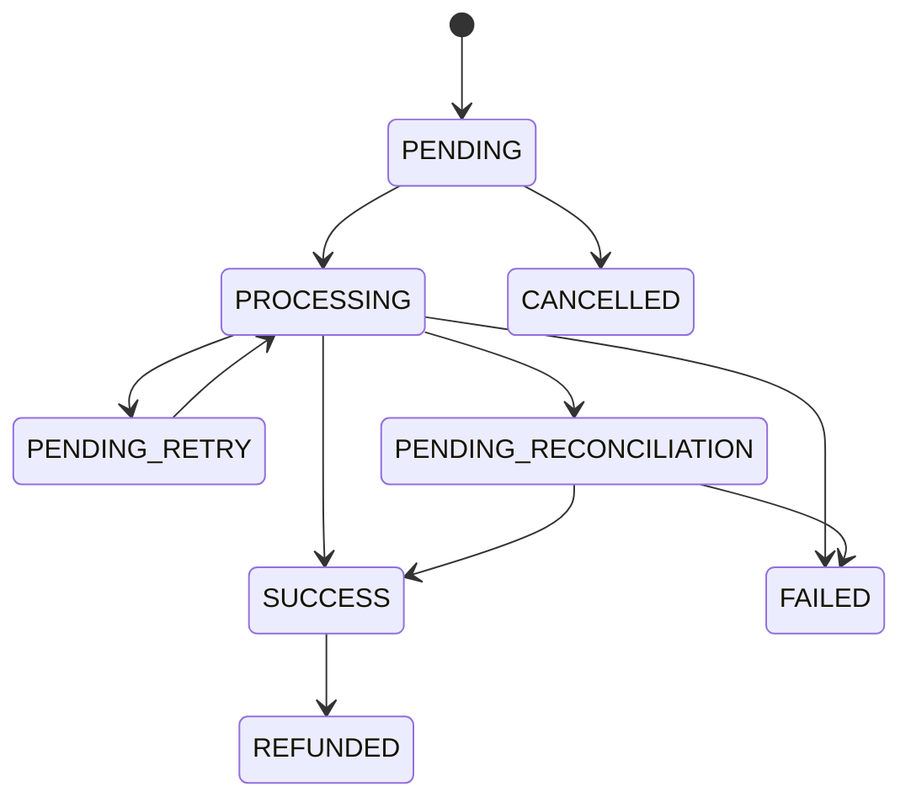
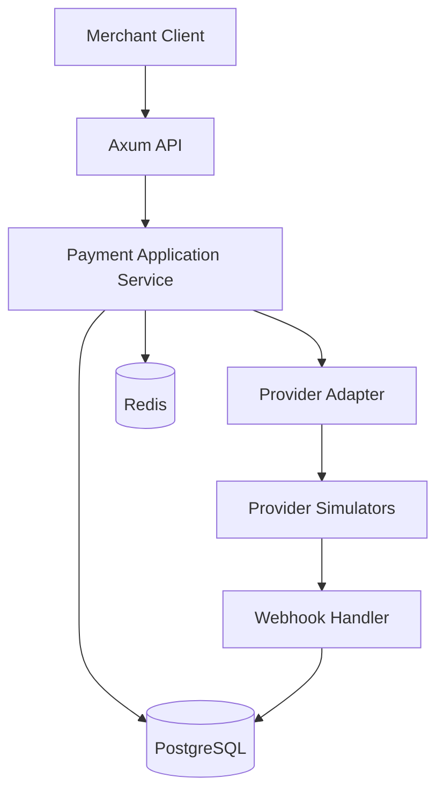

# Product Requirements Document

## Secure Payment Orchestrator

| Informasi | Nilai |
| --- | --- |
| Versi | 1.0 |
| Status | Draft untuk Proof of Concept |
| Tanggal | 13 September 2026 |
| Produk | Secure Payment Orchestrator |
| Platform | Backend API dan provider simulator |

## 1. Product Vision

Menyediakan payment orchestration API berbasis Rust yang memberikan kontrak konsisten kepada merchant, sekaligus membuktikan correctness, reliability, security, auditability, dan kemudahan integrasi pada sistem terdistribusi.

## 2. Problem Statement

Merchant membutuhkan integrasi pembayaran yang tidak bergantung pada kontrak spesifik satu provider. Request ulang, timeout, webhook berulang, dan perbedaan status antarprovider dapat menyebabkan transaksi ganda atau status tidak konsisten. Produk ini menyelesaikan masalah tersebut melalui API terpusat, idempotency, provider adapter, state machine, webhook security, dan rekonsiliasi.

## 3. Sasaran Produk

1. Menyediakan alur pembayaran end-to-end menggunakan provider simulator.
2. Membuktikan bahwa duplicate request dan duplicate webhook diproses dengan aman.
3. Menunjukkan strategi penanganan timeout dan status tidak pasti.
4. Memberikan audit trail lengkap untuk debugging dan security review.
5. Menyediakan dokumentasi dan test suite yang dapat dieksekusi oleh reviewer.

## 4. Persona

### 4.1 Merchant Developer

Developer yang mengintegrasikan aplikasi e-commerce atau fintech dengan API pembayaran. Membutuhkan API sederhana, error konsisten, dokumentasi jelas, dan webhook yang dapat diverifikasi.

### 4.2 Customer

Pengguna akhir yang menyelesaikan pembayaran melalui provider simulator dan ingin mengetahui hasil transaksi dengan jelas.

### 4.3 Operations Analyst

Pengguna internal yang mencari transaksi, memeriksa attempt, dan menjalankan rekonsiliasi ketika status tidak diketahui.

### 4.4 Security Reviewer

Reviewer yang memeriksa autentikasi, signature verification, replay protection, secret handling, auditability, dan dependency risk.

## 5. User Journey

### 5.1 Merchant Membuat Pembayaran

1. Merchant memperoleh API key POC.
2. Merchant mengirim `POST /api/v1/payments` dengan idempotency key.
3. Sistem memvalidasi autentikasi dan payload.
4. Sistem membuat payment dan memilih provider.
5. Merchant menerima payment ID, status, provider, dan payment URL.
6. Customer membuka payment URL.
7. Provider simulator menyelesaikan pembayaran.
8. Provider mengirim webhook.
9. Sistem memverifikasi dan memperbarui status.
10. Merchant mengambil status akhir melalui API.

### 5.2 Merchant Mengulang Request

1. Merchant tidak menerima respons karena koneksi terputus.
2. Merchant mengirim payload dan idempotency key yang sama.
3. Sistem menemukan request sebelumnya.
4. Sistem mengembalikan payment yang sama tanpa membuat transaksi baru.

### 5.3 Operations Menangani Status Tidak Pasti

1. Provider timeout setelah request dikirim.
2. Sistem menandai payment sebagai `PENDING_RECONCILIATION`.
3. Operations membuka detail payment.
4. Operations menjalankan endpoint rekonsiliasi.
5. Sistem meminta status terbaru dari provider.
6. Sistem memperbarui payment dan audit log.

## 6. Alur Status



## 7. Functional Requirements

### 7.1 Authentication dan Merchant

| ID | Requirement | Acceptance Criteria |
| --- | --- | --- |
| FR-AUTH-01 | Sistem menerima API key melalui header. | Request tanpa key atau key salah menerima HTTP 401. |
| FR-AUTH-02 | API key terikat pada merchant. | Payment menyimpan merchant ID dari kredensial yang tervalidasi. |
| FR-AUTH-03 | API key tidak disimpan dalam plaintext. | Database hanya menyimpan hash atau fingerprint key. |

### 7.2 Create Payment

| ID | Requirement | Acceptance Criteria |
| --- | --- | --- |
| FR-PAY-01 | Merchant dapat membuat payment. | Payload valid menghasilkan HTTP 201 dan payment ID unik. |
| FR-PAY-02 | Amount menggunakan integer unit terkecil. | Nilai nol, negatif, pecahan, atau melebihi limit ditolak. |
| FR-PAY-03 | Currency divalidasi. | Hanya IDR dan SGD yang diterima pada POC. |
| FR-PAY-04 | Sistem mencatat audit event. | Event `PAYMENT_CREATED` tersedia setelah payment dibuat. |
| FR-PAY-05 | Sistem memilih provider tersedia. | Response menyertakan provider terpilih. |

### 7.3 Idempotency

| ID | Requirement | Acceptance Criteria |
| --- | --- | --- |
| FR-IDM-01 | Header `Idempotency-Key` wajib pada create payment. | Header kosong menghasilkan HTTP 400. |
| FR-IDM-02 | Key dan payload sama mengembalikan hasil sebelumnya. | Payment ID pada request pertama dan kedua sama. |
| FR-IDM-03 | Key sama dengan payload berbeda ditolak. | Sistem menghasilkan HTTP 409. |
| FR-IDM-04 | Check dan insert bersifat atomik. | Concurrent request hanya menghasilkan satu payment row. |

### 7.4 Provider Orchestration

| ID | Requirement | Acceptance Criteria |
| --- | --- | --- |
| FR-ORC-01 | Semua provider mengimplementasikan kontrak internal yang sama. | Alpha, Beta, dan Gamma dapat dipanggil melalui `PaymentProvider` trait. |
| FR-ORC-02 | Setiap request provider memiliki timeout. | Request yang melewati batas dihentikan dan attempt dicatat. |
| FR-ORC-03 | Error provider dinormalisasi. | Domain menerima error category, bukan format mentah provider. |
| FR-ORC-04 | Retry hanya untuk transient error. | Timeout, 429, 502, dan 503 mengikuti retry policy. |
| FR-ORC-05 | Rejection tidak di-retry. | Provider rejection menghasilkan status failure yang sesuai. |
| FR-ORC-06 | Circuit breaker melindungi provider yang tidak sehat. | Request baru tidak dikirim ketika circuit berada pada status open. |
| FR-ORC-07 | Timeout tidak langsung memicu failover. | Sistem menjalankan rekonsiliasi sebelum provider lain digunakan. |

### 7.5 Webhook

| ID | Requirement | Acceptance Criteria |
| --- | --- | --- |
| FR-WEB-01 | Webhook diverifikasi menggunakan HMAC SHA-256. | Signature yang tidak cocok menghasilkan HTTP 401 atau 400 dan tidak mengubah payment. |
| FR-WEB-02 | Webhook memiliki timestamp tolerance. | Event di luar batas waktu ditolak. |
| FR-WEB-03 | Provider event ID harus unik. | Pengiriman event yang sama tidak mengulang perubahan bisnis. |
| FR-WEB-04 | Payload mentah disimpan untuk audit dengan redaction. | Event dapat ditelusuri tanpa mengekspos secret. |
| FR-WEB-05 | Transisi status harus valid. | Event yang mencoba menurunkan `SUCCESS` ke `PROCESSING` ditolak dan dicatat. |

### 7.6 Query, Cancel, dan Reconcile

| ID | Requirement | Acceptance Criteria |
| --- | --- | --- |
| FR-OPS-01 | Merchant dapat mengambil payment berdasarkan ID. | Payment milik merchant lain tidak dapat diakses. |
| FR-OPS-02 | Payment dapat dicari berdasarkan merchant reference dan status. | Filter menghasilkan data merchant yang sedang login. |
| FR-OPS-03 | Payment nonfinal dapat dibatalkan. | `SUCCESS` tidak dapat dibatalkan. |
| FR-OPS-04 | Operations dapat menjalankan rekonsiliasi. | Status provider diambil dan perubahan dicatat. |
| FR-OPS-05 | Retry manual memiliki guard. | Retry ditolak jika payment sedang diproses atau sudah final. |

### 7.7 Audit dan Observability

| ID | Requirement | Acceptance Criteria |
| --- | --- | --- |
| FR-OBS-01 | Setiap request memiliki request ID. | Request ID tampil pada response dan structured log. |
| FR-OBS-02 | Provider call memiliki correlation ID. | Attempt dapat dikaitkan dengan payment dan request. |
| FR-OBS-03 | Sistem menyediakan health dan readiness endpoint. | Readiness gagal jika database tidak tersedia. |
| FR-OBS-04 | Sistem mengekspor metrics Prometheus. | Counter dan latency provider dapat di-scrape. |
| FR-OBS-05 | Data sensitif tidak masuk log. | API key, HMAC secret, dan authorization header di-redact. |

## 8. API Contract Ringkas

| Method | Endpoint | Fungsi | Auth |
| --- | --- | --- | --- |
| POST | `/api/v1/payments` | Membuat pembayaran | Merchant API key |
| GET | `/api/v1/payments/{payment_id}` | Mengambil detail pembayaran | Merchant API key |
| GET | `/api/v1/payments` | Mencari pembayaran | Merchant API key |
| POST | `/api/v1/payments/{payment_id}/cancel` | Membatalkan pembayaran | Merchant API key |
| POST | `/api/v1/payments/{payment_id}/retry` | Retry manual | Operations key |
| POST | `/api/v1/payments/{payment_id}/reconcile` | Rekonsiliasi provider | Operations key |
| POST | `/api/v1/webhooks/{provider}` | Menerima event provider | HMAC signature |
| GET | `/health` | Liveness check | Tidak |
| GET | `/ready` | Readiness check | Tidak |
| GET | `/metrics` | Prometheus metrics | Internal |

### 8.1 Create Payment Request

```http
POST /api/v1/payments
Authorization: Bearer demo-api-key
Idempotency-Key: checkout-order-10001
Content-Type: application/json
```

```json
{
  "merchant_reference": "ORDER-10001",
  "amount": 250000,
  "currency": "IDR",
  "customer": {
    "name": "Budi Santoso",
    "email": "budi@example.com"
  },
  "description": "Pembayaran ORDER-10001"
}
```

### 8.2 Create Payment Response

```json
{
  "payment_id": "pay_01K5E9M2V7",
  "merchant_reference": "ORDER-10001",
  "status": "PROCESSING",
  "amount": 250000,
  "currency": "IDR",
  "provider": "ALPHA",
  "payment_url": "http://localhost:8081/pay/pay_01K5E9M2V7",
  "created_at": "2026-09-13T10:00:00Z"
}
```

### 8.3 Error Response

```json
{
  "error": {
    "code": "IDEMPOTENCY_CONFLICT",
    "message": "Idempotency key has been used with a different payload",
    "request_id": "req_01K5E9N12A"
  }
}
```

## 9. Data Model

### 9.1 payments

| Field | Type | Keterangan |
| --- | --- | --- |
| id | UUID | Primary key internal |
| public_id | VARCHAR | ID yang diekspos ke API |
| merchant_id | UUID | Pemilik transaksi |
| merchant_reference | VARCHAR | Referensi dari merchant |
| idempotency_key | VARCHAR | Key untuk request deduplication |
| request_hash | VARCHAR | Hash canonical payload |
| amount | BIGINT | Nilai dalam unit terkecil |
| currency | CHAR(3) | Kode ISO 4217 |
| status | VARCHAR | Status internal |
| selected_provider | VARCHAR | Provider yang digunakan |
| provider_payment_id | VARCHAR | ID payment dari provider |
| version | INTEGER | Optimistic concurrency version |
| created_at | TIMESTAMPTZ | Waktu pembuatan |
| updated_at | TIMESTAMPTZ | Waktu perubahan |
| paid_at | TIMESTAMPTZ | Waktu pembayaran berhasil |

Unique constraint utama:

```text
UNIQUE (merchant_id, idempotency_key)
```

### 9.2 payment_attempts

Menyimpan provider, nomor percobaan, kategori hasil, HTTP status, latency, provider reference, dan payload yang telah di-redact.

### 9.3 webhook_events

Menyimpan provider event ID, signature validity, payload terproteksi, processing result, received time, dan processed time.

### 9.4 audit_logs

Menyimpan payment ID, event type, status sebelum dan sesudah, actor type, actor ID, metadata, dan timestamp.

## 10. Arsitektur Logis



### 10.1 Struktur Modul

```text
src/
├── api/
├── application/
├── domain/
├── infrastructure/
├── providers/
├── security/
└── observability/
```

## 11. Nonfunctional Requirements

| ID | Area | Requirement |
| --- | --- | --- |
| NFR-01 | Performance | p95 read endpoint di bawah 300 ms pada local test environment. |
| NFR-02 | Concurrency | Concurrent create dengan key sama menghasilkan satu payment. |
| NFR-03 | Reliability | Semua external call memiliki timeout dan bounded retry. |
| NFR-04 | Security | Signature comparison harus constant time. |
| NFR-05 | Security | Dependency diperiksa dengan `cargo audit`. |
| NFR-06 | Maintainability | Domain layer tidak bergantung pada HTTP framework atau database. |
| NFR-07 | Observability | Log berformat JSON dan memuat request serta correlation ID. |
| NFR-08 | Portability | Semua komponen POC berjalan melalui Docker Compose. |
| NFR-09 | Quality | `cargo fmt`, `cargo clippy`, unit test, dan integration test lulus pada CI. |
| NFR-10 | Documentation | OpenAPI, README, threat model, dan failure scenarios tersedia. |

## 12. Security Requirements

1. Tidak menyimpan PAN, PIN, CVV, atau credential bank.
2. Secret tidak dimasukkan ke repository.
3. API key dibandingkan menggunakan hash yang sesuai.
4. HMAC mencakup timestamp dan raw request body.
5. Webhook lama dan replay event ditolak.
6. Input dibatasi ukuran dan formatnya.
7. SQL menggunakan parameterized query melalui SQLx.
8. Authorization memastikan merchant hanya mengakses datanya sendiri.
9. Log menerapkan redaction.
10. Threat model minimal mencakup spoofing, tampering, replay, information disclosure, dan denial of service.

## 13. Test Strategy

### 13.1 Unit Test

1. State transition.
2. Request canonicalization dan hash.
3. Retry classification.
4. Provider error mapping.
5. HMAC generation dan verification.

### 13.2 Integration Test

1. Create dan get payment dengan PostgreSQL.
2. Concurrent idempotent request.
3. Provider success, rejection, timeout, dan invalid response.
4. Webhook valid, invalid, expired, dan duplicate.
5. Reconciliation setelah timeout.

### 13.3 Failure Test

1. Database tidak tersedia.
2. Redis tidak tersedia.
3. Provider berhenti di tengah request.
4. Service restart setelah payment dibuat.
5. Dua worker memproses payment yang sama.

## 14. Release Scope

### Milestone 1, Core Payment

Axum API, domain state machine, PostgreSQL, create dan get payment, Alpha simulator, idempotency, audit log.

### Milestone 2, Security dan Reliability

HMAC webhook, duplicate protection, retry, timeout, reconciliation, structured logging.

### Milestone 3, Multi-Provider dan Portfolio Readiness

Beta dan Gamma simulator, circuit breaker, Redis lock, metrics, CI, OpenAPI, Postman, threat model, dan demo script.

## 15. Definition of Done

1. Semua acceptance criteria prioritas Must terpenuhi.
2. Test otomatis lulus secara lokal dan di CI.
3. Docker Compose menjalankan API, PostgreSQL, Redis, dan simulator.
4. Demo membuktikan happy path, idempotency, timeout, reconciliation, dan invalid webhook.
5. OpenAPI dan README dapat digunakan reviewer tanpa penjelasan tambahan.
6. Tidak ada secret atau data sensitif dalam repository dan log demo.
7. `cargo fmt`, `cargo clippy`, dan `cargo audit` selesai tanpa temuan kritis.

