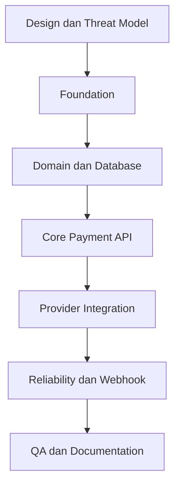

# Work Breakdown Structure

## Secure Payment Orchestrator

| Informasi | Nilai |
| --- | --- |
| Versi | 1.0 |
| Status | Baseline Plan untuk Proof of Concept |
| Tanggal | 13 September 2026 |
| Estimasi | 30 hari kerja, satu engineer full-time |
| Metode | Incremental delivery dengan test pada setiap fase |

## 1. Dasar Estimasi

1. Satu engineer bekerja sekitar 6 jam efektif per hari.
2. Engineer memiliki pengalaman backend dan pengetahuan dasar Rust.
3. Provider menggunakan simulator lokal, bukan layanan pembayaran nyata.
4. Scope mengikuti BRD dan PRD versi 1.0.
5. Estimasi termasuk coding, testing, dokumentasi, dan perbaikan hasil review.
6. Estimasi belum termasuk proses legal, compliance, atau deployment production.

## 2. Ringkasan WBS

| WBS | Workstream | Durasi | Deliverable Utama |
| --- | --- | ---: | --- |
| 1.0 | Inisiasi dan desain | 3 hari | Scope, architecture, ADR, threat model awal |
| 2.0 | Project foundation | 3 hari | Rust service, Docker environment, health check |
| 3.0 | Domain dan persistence | 4 hari | State machine, migrations, repository, audit |
| 4.0 | Core payment API | 4 hari | Create, get, search, idempotency, authentication |
| 5.0 | Provider integration | 4 hari | Trait, tiga simulator, adapter, error mapping |
| 6.0 | Reliability | 4 hari | Timeout, retry, reconciliation, locking, circuit breaker |
| 7.0 | Secure webhook | 3 hari | HMAC, replay protection, webhook processing |
| 8.0 | Observability dan operations | 2 hari | Logs, metrics, readiness, operations endpoints |
| 9.0 | Quality assurance | 2 hari | Integration, concurrency, dan failure tests |
| 10.0 | Dokumentasi dan handover | 1 hari | OpenAPI, Postman, README, demo script |
|  | **Total** | **30 hari** | POC siap demonstrasi |

## 3. Detail Task

### 1.0 Inisiasi dan Desain

| ID | Task | Durasi | Dependensi | Output |
| --- | --- | ---: | --- | --- |
| 1.1 | Konfirmasi scope, persona, dan success metrics | 0,5 hari | Tidak ada | Scope baseline |
| 1.2 | Menetapkan status dan transition matrix | 0,5 hari | 1.1 | Domain state diagram |
| 1.3 | Mendesain logical architecture dan module boundaries | 0,5 hari | 1.1 | Architecture diagram |
| 1.4 | Mendesain data model dan database constraints | 0,5 hari | 1.2 | ERD dan schema draft |
| 1.5 | Menentukan error taxonomy dan retry classification | 0,5 hari | 1.2 | Error catalogue |
| 1.6 | Membuat threat model awal | 0,5 hari | 1.3 | Threat model draft |

### 2.0 Project Foundation

| ID | Task | Durasi | Dependensi | Output |
| --- | --- | ---: | --- | --- |
| 2.1 | Membuat Cargo project dan module structure | 0,5 hari | 1.3 | Rust workspace |
| 2.2 | Menambahkan Axum, Tokio, Serde, Tracing, dan config | 0,5 hari | 2.1 | Service skeleton |
| 2.3 | Membuat standar error response dan request ID | 0,5 hari | 2.2 | Error middleware |
| 2.4 | Membuat Dockerfile dan Docker Compose | 0,5 hari | 2.1 | Local environment |
| 2.5 | Menambahkan PostgreSQL, Redis, dan migrations runner | 0,5 hari | 2.4 | Runtime dependencies |
| 2.6 | Membuat health check, readiness stub, dan graceful shutdown | 0,5 hari | 2.2 | Operational endpoints |

### 3.0 Domain dan Persistence

| ID | Task | Durasi | Dependensi | Output |
| --- | --- | ---: | --- | --- |
| 3.1 | Membuat entity Payment, Money, Currency, dan Status | 0,5 hari | 1.2, 2.1 | Domain types |
| 3.2 | Mengimplementasikan transition rules | 0,5 hari | 3.1 | Payment state machine |
| 3.3 | Membuat migrations untuk merchant dan payments | 0,5 hari | 1.4, 2.5 | Core schema |
| 3.4 | Membuat migrations untuk attempts, webhooks, dan audit | 0,5 hari | 3.3 | Supporting schema |
| 3.5 | Membuat repository traits | 0,5 hari | 3.1 | Persistence contracts |
| 3.6 | Mengimplementasikan SQLx repositories | 1 hari | 3.3, 3.4, 3.5 | PostgreSQL repositories |
| 3.7 | Membuat transaction boundary dan concurrency guard | 0,5 hari | 3.6 | Atomic operations |

### 4.0 Core Payment API

| ID | Task | Durasi | Dependensi | Output |
| --- | --- | ---: | --- | --- |
| 4.1 | Membuat merchant API key authentication | 0,5 hari | 3.3 | Auth middleware |
| 4.2 | Membuat request validation dan canonical request hash | 0,5 hari | 3.1 | Validated commands |
| 4.3 | Membuat create payment use case | 0,75 hari | 3.6, 4.2 | Application service |
| 4.4 | Membuat idempotency handling | 0,75 hari | 3.7, 4.3 | Duplicate protection |
| 4.5 | Membuat create payment endpoint | 0,5 hari | 4.1, 4.3 | POST payments |
| 4.6 | Membuat get dan search endpoint | 0,5 hari | 4.1, 3.6 | Query API |
| 4.7 | Membuat cancel endpoint dan rule | 0,5 hari | 3.2, 4.1 | Cancel API |

### 5.0 Provider Integration

| ID | Task | Durasi | Dependensi | Output |
| --- | --- | ---: | --- | --- |
| 5.1 | Mendefinisikan `PaymentProvider` trait | 0,5 hari | 1.3, 3.1 | Provider contract |
| 5.2 | Membuat normalized provider request, response, dan error | 0,5 hari | 1.5, 5.1 | Provider DTO dan error |
| 5.3 | Membuat Alpha provider simulator | 0,5 hari | 5.2 | Stable simulator |
| 5.4 | Membuat Alpha adapter | 0,5 hari | 5.3 | First integration |
| 5.5 | Membuat Beta simulator dan adapter | 0,5 hari | 5.2 | Timeout simulator |
| 5.6 | Membuat Gamma simulator dan adapter | 0,5 hari | 5.2 | Rejection simulator |
| 5.7 | Membuat provider registry dan selection policy | 0,5 hari | 5.4, 5.5, 5.6 | Provider routing |
| 5.8 | Menyimpan payment attempt dengan redaction | 0,5 hari | 3.4, 5.4 | Attempt history |

### 6.0 Reliability

| ID | Task | Durasi | Dependensi | Output |
| --- | --- | ---: | --- | --- |
| 6.1 | Menambahkan timeout untuk provider request | 0,5 hari | 5.4 | Bounded call duration |
| 6.2 | Membuat retry policy dan exponential backoff | 0,5 hari | 1.5, 6.1 | Safe retry |
| 6.3 | Mengimplementasikan uncertain status handling | 0,5 hari | 3.2, 6.1 | Pending reconciliation flow |
| 6.4 | Membuat provider status query | 0,5 hari | 5.1, 6.3 | Reconciliation adapter |
| 6.5 | Membuat reconciliation endpoint dan use case | 0,5 hari | 6.4, 4.1 | Reconciliation API |
| 6.6 | Menambahkan Redis distributed lock | 0,5 hari | 2.5, 4.4 | Worker coordination |
| 6.7 | Membuat circuit breaker sederhana | 0,5 hari | 5.7, 6.1 | Provider protection |
| 6.8 | Membuat retry manual dengan authorization guard | 0,5 hari | 4.1, 6.2 | Operations retry API |

### 7.0 Secure Webhook

| ID | Task | Durasi | Dependensi | Output |
| --- | --- | ---: | --- | --- |
| 7.1 | Menentukan signature format dan timestamp policy | 0,25 hari | 1.6 | Webhook contract |
| 7.2 | Membuat raw body capture dan HMAC verification | 0,75 hari | 2.2, 7.1 | Signature middleware |
| 7.3 | Membuat constant-time comparison | 0,25 hari | 7.2 | Timing-safe verification |
| 7.4 | Membuat provider event deduplication | 0,5 hari | 3.4, 3.7 | Replay protection |
| 7.5 | Membuat webhook processing dan status update | 0,75 hari | 3.2, 7.2, 7.4 | Webhook handler |
| 7.6 | Membuat webhook simulator dan test cases | 0,5 hari | 5.3, 7.5 | Verifiable webhook flow |

### 8.0 Observability dan Operations

| ID | Task | Durasi | Dependensi | Output |
| --- | --- | ---: | --- | --- |
| 8.1 | Menambahkan JSON logging dan correlation ID | 0,5 hari | 2.3, 5.8 | Structured logs |
| 8.2 | Menambahkan sensitive data redaction | 0,25 hari | 8.1 | Safe logs |
| 8.3 | Menambahkan Prometheus metrics | 0,5 hari | 6.2, 7.5 | Metrics endpoint |
| 8.4 | Menyelesaikan readiness dependency checks | 0,25 hari | 2.6, 3.6 | Readiness endpoint |
| 8.5 | Membuat audit history query untuk demo | 0,5 hari | 3.4, 4.1 | Operations visibility |

### 9.0 Quality Assurance

| ID | Task | Durasi | Dependensi | Output |
| --- | --- | ---: | --- | --- |
| 9.1 | Melengkapi unit test domain dan security | 0,5 hari | 3.2, 7.3 | Unit test suite |
| 9.2 | Membuat API dan database integration test | 0,5 hari | 4.7, 7.5 | Integration tests |
| 9.3 | Membuat concurrency dan idempotency test | 0,25 hari | 4.4, 6.6 | Race-condition tests |
| 9.4 | Membuat provider failure dan recovery test | 0,25 hari | 6.7 | Failure tests |
| 9.5 | Menjalankan formatting, linting, audit, dan test coverage | 0,25 hari | 9.1 sampai 9.4 | Quality report |
| 9.6 | Bug fixing dan regression test | 0,25 hari | 9.5 | Stable release candidate |

### 10.0 Dokumentasi dan Handover

| ID | Task | Durasi | Dependensi | Output |
| --- | --- | ---: | --- | --- |
| 10.1 | Menyelesaikan OpenAPI dan contoh payload | 0,25 hari | 4.7, 6.5, 7.5 | API specification |
| 10.2 | Membuat Postman collection dan environment | 0,25 hari | 10.1 | Executable API demo |
| 10.3 | Menulis README, architecture, dan ADR | 0,25 hari | Seluruh development | Technical documentation |
| 10.4 | Menulis demo script dan known limitations | 0,25 hari | 9.6 | Handover package |

## 4. Milestone

| Milestone | Target | Exit Criteria |
| --- | --- | --- |
| M1, Design Approved | Akhir hari 3 | Scope, architecture, data model, dan threat model awal tersedia. |
| M2, Core Payment Ready | Akhir hari 14 | Create, get, authentication, idempotency, persistence, dan Alpha provider berfungsi. |
| M3, Reliability Ready | Akhir hari 22 | Multi-provider, timeout, retry, reconciliation, lock, dan circuit breaker berfungsi. |
| M4, Security Ready | Akhir hari 25 | HMAC webhook, replay protection, dan valid transition berfungsi. |
| M5, POC Complete | Akhir hari 30 | Test, documentation, CI, dan demo scenario selesai. |

## 5. Dependensi Utama



## 6. Prioritas Backlog

### Must Have

1. Authentication.
2. Create dan get payment.
3. Idempotency dengan database constraint.
4. Provider trait dan Alpha simulator.
5. Payment attempt dan audit log.
6. Timeout serta retry classification.
7. HMAC webhook dan duplicate protection.
8. Reconciliation.
9. Unit dan integration test.
10. Docker Compose serta OpenAPI.

### Should Have

1. Beta dan Gamma provider.
2. Redis distributed lock.
3. Circuit breaker.
4. Prometheus metrics.
5. Search, cancel, dan manual retry.

### Could Have

1. Dashboard operator sederhana.
2. OpenTelemetry distributed tracing.
3. Refund penuh.
4. Load testing report.

## 7. Critical Path

```text
Architecture
→ Domain Model
→ Database Schema
→ Create Payment
→ Provider Adapter
→ Webhook Processing
→ Integration Test
→ Demo Release
```

Keterlambatan pada domain state machine, database transaction, atau provider contract akan berdampak langsung pada milestone akhir.

## 8. RACI Ringkas

| Aktivitas | Product Owner | Rust Engineer | QA | Security Reviewer |
| --- | --- | --- | --- | --- |
| Scope dan prioritas | A/R | C | C | C |
| Architecture | C | A/R | C | C |
| Development | I | A/R | C | C |
| Functional testing | I | C | A/R | I |
| Security review | I | C | C | A/R |
| POC acceptance | A/R | C | C | C |

Keterangan: R = Responsible, A = Accountable, C = Consulted, I = Informed.

## 9. Risiko Jadwal

| Risiko | Dampak | Respons |
| --- | --- | --- |
| Learning curve Rust | Estimasi task meningkat | Fokus pada satu framework dan gunakan incremental test. |
| Terlalu cepat menambah fitur | Core flow tidak stabil | Bekukan Must Have sampai Milestone 2 selesai. |
| Concurrency bug ditemukan terlambat | Rework persistence | Buat concurrent idempotency test pada fase core API. |
| Simulator terlalu kompleks | Waktu habis di non-core feature | Batasi simulator pada success, rejection, timeout, dan invalid response. |
| Security requirement terlambat | Redesign webhook | Tetapkan signature contract dan threat model sejak fase desain. |

## 10. Definition of Done per Task

Sebuah development task dianggap selesai jika:

1. Implementasi sesuai acceptance criteria.
2. Unit test atau integration test yang relevan tersedia.
3. `cargo fmt` dan `cargo clippy` lulus.
4. Tidak ada secret atau data sensitif pada source dan log.
5. Error ditangani tanpa `unwrap()` pada production path.
6. Dokumentasi publik diperbarui jika kontrak API berubah.
7. Code telah melalui self-review atau peer review.

## 11. Deliverables Akhir

1. Source code Rust.
2. Database migrations.
3. Provider simulators.
4. Dockerfile dan Docker Compose.
5. OpenAPI specification.
6. Postman collection dan environment.
7. Automated test suite.
8. CI configuration.
9. Threat model dan architecture decision records.
10. README, demo script, dan known limitations.

